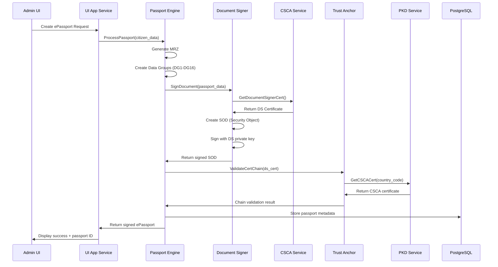
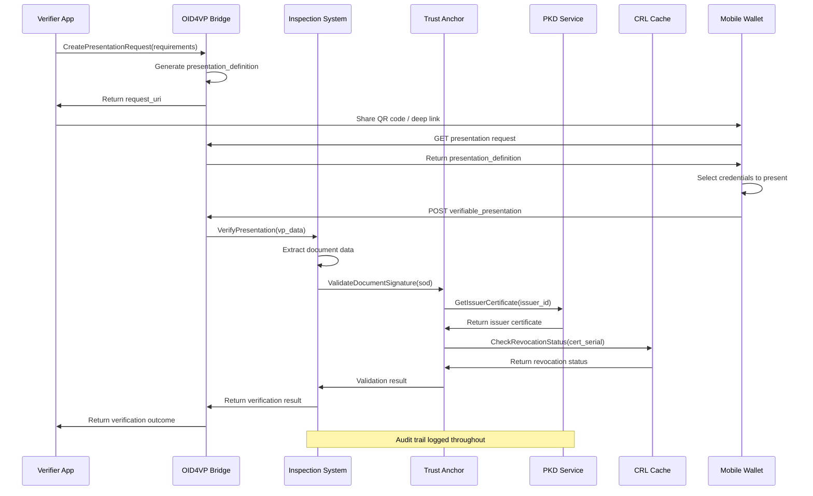

# Marty Platform Architecture - The Map of Marty

## Overview

Marty is an educational implementation of ICAO PKI standards for digital identity documents, built as a microservices platform that demonstrates modern approaches to certificate management, document issuance, and verification protocols.

## Mental Model

The Marty platform is organized around four core architectural layers:

1. **Trust Services** - Certificate authority management, PKD ingestion, and trust establishment
2. **Document Engines** - Specialized engines for different document types (ePassports, mDL/mDoc, DTC)
3. **Bridges** - Protocol adapters for modern standards (OIDC4VCI, OID4VP)
4. **Infrastructure** - Gateway, storage, KMS, and observability

## System Architecture

```
┌─────────────────────────────────────────────────────────────────────┐
│                           CLIENT LAYER                              │
├─────────────────┬─────────────────┬─────────────────┬───────────────┤
│   Mobile Apps   │  Verification   │   Admin UI      │  Integration  │
│   (Wallets)     │   Systems       │   (FastAPI)     │   Partners    │
└─────────┬───────┴─────────┬───────┴─────────┬───────┴───────┬───────┘
          │                 │                 │               │
          └─────────────────┼─────────────────┼───────────────┘
                            │                 │
                ┌───────────▼─────────────────▼───────────┐
                │            GATEWAY LAYER                │
                │        UI App Service (8090)            │
                │      gRPC Gateway + REST API            │
                └─────────────────┬───────────────────────┘
                                  │
        ┌─────────────────────────┼─────────────────────────┐
        │                        │                         │
        ▼                        ▼                         ▼
┌───────────────┐     ┌─────────────────┐      ┌─────────────────┐
│  TRUST        │     │  DOCUMENT       │      │  BRIDGES        │
│  SERVICES     │     │  ENGINES        │      │                 │
│               │     │                 │      │                 │
│ ┌───────────┐ │     │ ┌─────────────┐ │      │ ┌─────────────┐ │
│ │CSCA Svc   │ │     │ │Passport Eng │ │      │ │OIDC4VCI     │ │
│ │(8081)     │ │     │ │(8084)       │ │      │ │Bridge       │ │
│ └───────────┘ │     │ └─────────────┘ │      │ └─────────────┘ │
│               │     │                 │      │                 │
│ ┌───────────┐ │     │ ┌─────────────┐ │      │ ┌─────────────┐ │
│ │Trust      │ │     │ │MDL Engine   │ │      │ │OID4VP       │ │
│ │Anchor     │ │     │ │(8085)       │ │      │ │Bridge       │ │
│ │(9080/8080)│ │     │ └─────────────┘ │      │ └─────────────┘ │
│ └───────────┘ │     │                 │      │                 │
│               │     │ ┌─────────────┐ │      │ ┌─────────────┐ │
│ ┌───────────┐ │     │ │mDoc Engine  │ │      │ │EUDI Bridge  │ │
│ │PKD Service│ │     │ │(8086)       │ │      │ │             │ │
│ │(8088)     │ │     │ └─────────────┘ │      │ └─────────────┘ │
│ └───────────┘ │     │                 │      └─────────────────┘
│               │     │ ┌─────────────┐ │
│ ┌───────────┐ │     │ │DTC Engine   │ │
│ │Inspection │ │     │ │(8087)       │ │
│ │System     │ │     │ └─────────────┘ │
│ │(8083)     │ │     └─────────────────┘
│ └───────────┘ │
└───────────────┘              │
        │                      │
        └──────────────────────┼─────────────────┐
                               │                 │
                    ┌──────────▼─────────┐      │
                    │   DOCUMENT SIGNER   │      │
                    │     SERVICE         │      │
                    │      (8082)         │      │
                    └─────────┬───────────┘      │
                              │                  │
┌─────────────────────────────┼──────────────────▼──────────────────┐
│                    INFRASTRUCTURE LAYER                           │
├─────────────────┬───────────┴─────────┬──────────────────────────┤
│     STORAGE     │         KMS         │      OBSERVABILITY       │
│                 │                     │                          │
│ ┌─────────────┐ │ ┌─────────────────┐ │ ┌──────────────────────┐ │
│ │PostgreSQL   │ │ │Crypto Boundaries│ │ │Prometheus Monitoring │ │
│ │(5432)       │ │ │& Role Separation│ │ │                      │ │
│ └─────────────┘ │ └─────────────────┘ │ └──────────────────────┘ │
│                 │                     │                          │
│ ┌─────────────┐ │ ┌─────────────────┐ │ ┌──────────────────────┐ │
│ │OpenXPKI     │ │ │KMS Provider     │ │ │Centralized Logging   │ │
│ │(External)   │ │ │(HSM/Cloud KMS)  │ │ │                      │ │
│ └─────────────┘ │ └─────────────────┘ │ └──────────────────────┘ │
│                 │                     │                          │
│ ┌─────────────┐ │ ┌─────────────────┐ │ ┌──────────────────────┐ │
│ │Trust Store  │ │ │Evidence Signing │ │ │Security Monitoring   │ │
│ │& CRL Cache  │ │ │& Audit Trails   │ │ │                      │ │
│ └─────────────┘ │ └─────────────────┘ │ └──────────────────────┘ │
└─────────────────┴─────────────────────┴──────────────────────────┘
```

## Trust Services Layer

The Trust Services layer establishes and maintains the cryptographic trust foundation for the entire platform.

### CSCA Service (Port 8081)
**Purpose**: Country Signing Certificate Authority management
- **Location**: [`src/csca_service/`](../src/csca_service/)
- **Responsibilities**:
  - CSCA certificate lifecycle management
  - Master list generation and signing
  - Certificate revocation management
  - Integration with OpenXPKI for PKI operations

### Trust Anchor Service (Port 9080/8080)
**Purpose**: Central trust anchor management and verification
- **Location**: [`src/trust_anchor/`](../src/trust_anchor/)
- **Responsibilities**:
  - Trust anchor store management
  - Certificate path validation
  - Trust policy enforcement
  - Certificate expiry monitoring
- **Key Components**:
  - [`CertificateExpiryService`](../src/trust_anchor/app/services/certificate_expiry_service.py)
  - [`CertificateRevocationService`](../src/trust_anchor/app/services/certificate_revocation_service.py)

### PKD Service (Port 8088)
**Purpose**: Public Key Directory and CSCA Master List management
- **Location**: [`src/pkd_service/`](../src/pkd_service/)
- **Responsibilities**:
  - PKD data ingestion and synchronization
  - CSCA Master List processing
  - ICAO PKD protocol implementation
  - OpenXPKI bridge operations
- **Integration**: OpenXPKI bridge for enterprise PKI operations

### Inspection System (Port 8083)
**Purpose**: Document verification and validation
- **Location**: [`src/inspection_system/`](../src/inspection_system/)
- **Responsibilities**:
  - Document authenticity verification
  - Certificate chain validation
  - Security feature verification
  - Verification audit logging

## Document Engines Layer

Specialized engines handle different document types according to their respective international standards.

### Passport Engine (Port 8084)
**Purpose**: ICAO Doc 9303 compliant ePassport processing
- **Location**: [`src/passport_engine/`](../src/passport_engine/)
- **Standards**: ICAO Doc 9303 (eMRTD)
- **Capabilities**:
  - Machine Readable Zone (MRZ) processing
  - Data Group (DG) management
  - Document Security Object (SOD) creation
  - Active Authentication support
  - Passive Authentication implementation

### MDL Engine (Port 8085)
**Purpose**: ISO/IEC 18013-5 mobile driving license processing
- **Location**: [`src/mdl_engine/`](../src/mdl_engine/)
- **Standards**: ISO/IEC 18013-5
- **Capabilities**:
  - Mobile Document format support
  - Device Authentication
  - Issuer Data Authentication (IDA)
  - Age verification protocols
  - Selective disclosure mechanisms

### mDoc Engine (Port 8086)
**Purpose**: General mobile document processing beyond mDL
- **Location**: [`src/mdoc_engine/`](../src/mdoc_engine/)
- **Standards**: ISO/IEC 18013-5 (extended)
- **Capabilities**:
  - Generic mDoc issuance
  - Custom document type support
  - Flexible data structure handling
  - Multi-namespace document support

### DTC Engine (Port 8087)
**Purpose**: Digital Travel Credential processing
- **Location**: [`src/dtc_engine/`](../src/dtc_engine/)
- **Standards**: ICAO Visible Digital Seal (VDS)
- **Capabilities**:
  - Digital travel credential issuance
  - Visible Digital Seal creation
  - Travel document verification
  - Border control integration

## Bridges Layer

Protocol bridges enable integration with modern identity and verification standards.

### OIDC4VCI Bridge
**Purpose**: OpenID for Verifiable Credential Issuance integration
- **Location**: [`src/bridges/oidc4vci/`](../src/bridges/oidc4vci/)
- **Standards**: OpenID4VCI specification
- **Capabilities**:
  - Credential offer generation
  - Authorization code flow
  - Token-based credential issuance
  - Wallet integration

### OID4VP Bridge
**Purpose**: OpenID for Verifiable Presentations integration
- **Location**: [`src/bridges/oid4vp/`](../src/bridges/oid4vp/)
- **Standards**: OpenID4VP specification
- **Capabilities**:
  - Presentation request handling
  - Selective disclosure
  - Presentation verification
  - Cross-platform compatibility

### EUDI Bridge
**Purpose**: European Digital Identity Wallet integration
- **Location**: [`src/bridges/eudi/`](../src/bridges/eudi/)
- **Standards**: EU ARF (Architecture Reference Framework)
- **Capabilities**:
  - EU wallet compatibility
  - Cross-border verification
  - PID (Person Identification Data) support
  - EAA (Electronic Attribute Attestation) support

## Infrastructure Layer

### Gateway Layer

#### UI App Service (Port 8090)
**Purpose**: Unified gateway and operator interface
- **Location**: [`src/ui_app/`](../src/ui_app/)
- **Responsibilities**:
  - gRPC-to-REST translation
  - Service orchestration
  - Operator dashboard
  - API gateway functionality
- **Technologies**: FastAPI, gRPC gateway

### Storage Layer

#### PostgreSQL Database (Port 5432)
**Purpose**: Primary data persistence
- **Configuration**: [`config/`](../config/)
- **Responsibilities**:
  - Certificate storage
  - Document metadata
  - Audit logs
  - Configuration data

#### OpenXPKI Integration
**Purpose**: Enterprise PKI operations
- **Integration**: External PKI system
- **Responsibilities**:
  - Certificate lifecycle management
  - CRL management
  - OCSP responder
  - PKI policy enforcement

#### Trust Store & CRL Cache
**Purpose**: Distributed trust data management
- **Location**: [`data/trust/`](../data/trust/)
- **Components**:
  - Certificate trust store
  - CRL cache
  - OCSP response cache
  - Master list cache

### KMS Layer

#### Crypto Boundaries & Role Separation
**Purpose**: Cryptographic security and role enforcement
- **Location**: [`src/marty_common/crypto/`](../src/marty_common/crypto/)
- **Components**:
  - [`role_separation.py`](../src/marty_common/crypto/role_separation.py) - Enforces strict crypto role boundaries
  - [`kms_provider.py`](../src/marty_common/crypto/kms_provider.py) - Multi-provider KMS abstraction
  - [`evidence_signing.py`](../src/marty_common/crypto/evidence_signing.py) - Tamper-evident audit logging

#### KMS Provider Support
**Supported Providers**:
- AWS KMS
- Azure Key Vault
- Google Cloud KMS
- Software HSM (development)

### Observability Layer

#### Prometheus Monitoring
**Purpose**: Metrics collection and alerting
- **Configuration**: [`monitoring/prometheus/`](../monitoring/prometheus/)
- **Dashboards**: [`monitoring/grafana/`](../monitoring/grafana/)
- **Metrics**: Service health, performance, business KPIs

#### Centralized Logging
**Purpose**: Unified log aggregation and analysis
- **Implementation**: [`src/marty_common/logging/`](../src/marty_common/logging/)
- **Features**: Structured logging, correlation IDs, audit trails

#### Security Monitoring
**Purpose**: Security event detection and response
- **Components**: Authentication monitoring, access control, threat detection

## Document Signer Service (Port 8082)

**Purpose**: Central document signing and certificate management
- **Location**: [`src/document_signer/`](../src/document_signer/)
- **Responsibilities**:
  - Document signing operations
  - Certificate management
  - Key lifecycle operations
  - HSM integration

## Reference Flows

### Flow 1: Document Issuance (ePassport Example)



**Key Code References**:
- Passport processing: [`src/passport_engine/services/passport_service.py`](../src/passport_engine/services/passport_service.py)
- Document signing: [`src/document_signer/services/signing_service.py`](../src/document_signer/services/signing_service.py)
- SOD creation: [`src/marty_common/models/sod.py`](../src/marty_common/models/sod.py)
- Certificate validation: [`src/trust_anchor/services/validation_service.py`](../src/trust_anchor/services/validation_service.py)

### Flow 2: Document Verification with OIDC4VP Bridge



**Key Code References**:
- OID4VP implementation: [`src/bridges/oid4vp/presentation_service.py`](../src/bridges/oid4vp/presentation_service.py)
- Document verification: [`src/inspection_system/services/verification_service.py`](../src/inspection_system/services/verification_service.py)
- Certificate validation: [`src/trust_anchor/services/certificate_validation.py`](../src/trust_anchor/services/certificate_validation.py)
- CRL checking: [`src/trust_anchor/services/revocation_service.py`](../src/trust_anchor/services/revocation_service.py)

## Service Communication

### gRPC Service Definitions
- **Location**: [`proto/`](../proto/)
- **Generated Code**: [`src/proto/`](../src/proto/)
- **Service Factory**: [`src/marty_common/grpc_service_factory.py`](../src/marty_common/grpc_service_factory.py)

### Shared Libraries
- **Common Models**: [`src/marty_common/models/`](../src/marty_common/models/)
- **Cryptographic Utilities**: [`src/marty_common/crypto/`](../src/marty_common/crypto/)
- **Configuration Management**: [`src/marty_common/config/`](../src/marty_common/config/)
- **Testing Utilities**: [`src/marty_common/testing/`](../src/marty_common/testing/)

## Configuration and Deployment

### Environment Configuration
- **Development**: [`config/development.yaml`](../config/development.yaml)
- **Testing**: [`config/testing.yaml`](../config/testing.yaml)
- **Production**: [`config/production.yaml`](../config/production.yaml)

### Container Orchestration
- **Docker Compose**: [`docker/docker-compose.yml`](../docker/docker-compose.yml)
- **Kubernetes**: [`k8s/`](../k8s/)
- **Helm Charts**: [`helm/`](../helm/)

### Security Configuration
- **Crypto Boundaries**: [`config/security/crypto_boundaries.yaml`](../config/security/crypto_boundaries.yaml)
- **Security Policy**: [`config/security/security_policy.yaml`](../config/security/security_policy.yaml)

## Development Patterns

### Service Generation
- **Templates**: [`templates/service/`](../templates/service/)
- **Generator**: [`scripts/generate_service.py`](../scripts/generate_service.py)
- **Documentation**: [`docs/SERVICE_TEMPLATE_GUIDE.md`](SERVICE_TEMPLATE_GUIDE.md)

### DRY Patterns
- **Implementation Guide**: [`docs/DRY_IMPLEMENTATION_GUIDE.md`](DRY_IMPLEMENTATION_GUIDE.md)
- **Service Factory**: [`docs/GRPC_SERVICE_FACTORY_GUIDE.md`](GRPC_SERVICE_FACTORY_GUIDE.md)

### Testing Strategy
- **Unit Tests**: Service-specific test suites
- **Integration Tests**: [`tests/integration/`](../tests/integration/)
- **End-to-End Tests**: [`tests/e2e/`](../tests/e2e/)
- **Certificate Validation**: [`tests/cert_validator/`](../tests/cert_validator/)

## Security Architecture

### Cryptographic Boundaries
The platform enforces strict separation between different cryptographic roles:

1. **CSCA Keys**: Country-level signing authority (HSM required)
2. **Document Signer Keys**: Document signing certificates
3. **Reader/Verifier Keys**: Document verification
4. **Wallet/Holder Keys**: End-user credential storage
5. **Evidence Signing Keys**: Audit trail integrity
6. **Transport Encryption**: Communication security
7. **Data Encryption**: Data at rest protection
8. **Authentication Keys**: Service authentication

### Trust Model
- **Root of Trust**: ICAO PKD and national CSCA certificates
- **Certificate Chains**: Validated through Trust Anchor service
- **Revocation**: CRL and OCSP checking
- **Policy Enforcement**: Configurable trust policies

## Monitoring and Observability

### Metrics Collection
- **Business Metrics**: Document issuance/verification rates
- **Technical Metrics**: Service health, latency, error rates
- **Security Metrics**: Authentication events, failed verifications

### Logging Strategy
- **Structured Logging**: JSON format with correlation IDs
- **Audit Trails**: Cryptographically signed evidence
- **Security Events**: Authentication, authorization, access

### Alerting
- **Service Health**: Availability and performance alerts
- **Security Events**: Suspicious activity detection
- **Business Critical**: Document processing failures

---

This architecture serves as the foundation for understanding how Marty implements international digital identity standards in a modern, scalable, and secure manner. Each component is designed to be independently deployable while maintaining strong integration patterns and comprehensive observability.